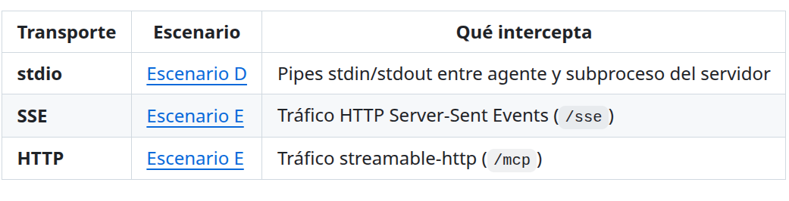
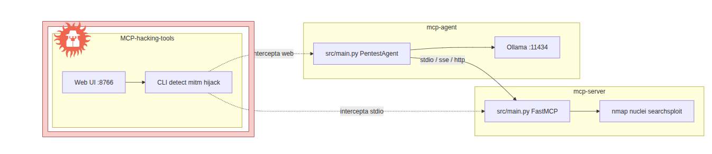

# 6.1 Caso 1 — Arquitecturas agénticas

<p><span class="pill">motores LLM</span> <span class="pill">MCP</span> <span class="pill">A2A</span> <span class="pill">surface</span></p>

**Objetivo:** documentar y analizar las **arquitecturas agénticas locales**: motores de inferencia, protocolos de integración (tools, MCP, A2A) y el modelo operativo del agente (permisos, *skills*, *tools*).

**Alcance:** todo lo desplegado y evaluado en el laboratorio del §5.

<div class="card-grid">
<div class="card"><h4>6.1.1 Motores</h4><p>Ollama · LocalAI · vLLM · monitor · benchmark · ataque API</p></div>
<div class="card"><h4>6.1.2 MCP</h4><p>stdio / SSE / HTTP · Inspector · MitM</p></div>
<div class="card"><h4>6.1.3 A2A</h4><p>Agent Cards · spoofing · DoS + prompt injection</p></div>
<div class="card"><h4>6.1.4 Permisos</h4><p>Codex · Cline · Claude Code · OpenCode · Surface Auditor</p></div>
</div>

---

## 6.1.1 Motores LLM locales

Instalar y comparar motores de inferencia local como backend de un agente. Motores evaluados: **Ollama**, **LocalAI**, **vLLM**.

Por cada uno: PoC de instalación en Ubuntu Server, pruebas mínimas y análisis de la **configuración por defecto**. Complementos de rendimiento:

1. Web de monitorización del servidor de inferencia  
2. Scripts de benchmark comparativo  

### Ollama

Herramienta open-source para administrar y ejecutar LLMs en local (CLI o app de escritorio). En el host del lab se usa **solo CLI**.

```bash
curl -fsSL https://ollama.com/install.sh | sh
```

Servicio systemd en el arranque, con configuración orientada a cargar modelos en la **AMD RX 7900 XTX** (OCuLink).

### LocalAI

Motor open-source con API compatible OpenAI / Anthropic / ElevenLabs. A diferencia de Ollama, expone una **WebUI** de administración e interacción.

Despliegue vía **imagen Docker** + servicio systemd. Modelos en directorio local compartido.

### vLLM

Motor orientado a inferencia de producción: mínima latencia, alto throughput. Docker en Ubuntu Server, **un modelo** con ROCm explícito sobre la 7900 XTX (24 GB VRAM), compartiendo el store de modelos con LocalAI.

### Pruebas de rendimiento

**Inference-Monitor** — web Docker que, vía API del SO, monitoriza recursos y administra Ollama / LocalAI / vLLM.

<div class="card"><h4>📦 Inference-monitor</h4><p><a href="https://github.com/agentef0ns1/Inference-monitor">github.com/agentef0ns1/Inference-monitor</a></p></div>

**Benchmark** — mismo hardware, modelo comparable **Qwen3-14B** (~16 GB VRAM). Objetivo: qué motor responde mejor para los ejercicios del TFM.

<div class="card"><h4>📦 benchmark-inference-monitor</h4><p><a href="https://github.com/agentef0ns1/benchmark-inference-monitor">github.com/agentef0ns1/benchmark-inference-monitor</a></p></div>

### Superficie de ataque en motores LLM

La superficie no difiere de otro software con exposición externa: **interna** (ficheros, permisos, usuario del proceso) y **externa** (APIs HTTP de admin e inferencia).

Vulnerabilidades por defecto frecuentes:

- HTTP sin TLS  
- APIs **sin autenticación**  
- Binding a `0.0.0.0`  

#### Compromiso del servidor agéntico (lab)

Escenario: web en tiempo real alimentada por un agente → LLM. Vector de entrada: **Ollama expuesto sin auth**. Herramienta:

<div class="card"><h4>📦 ollama-hacking-tools</h4><p><a href="https://github.com/agentef0ns1/ollama-hacking-tools">github.com/agentef0ns1/ollama-hacking-tools</a></p></div>

Intrusión con **RCE vía modelos maliciosos**:

<div class="video-wrap">
<iframe src="https://www.youtube.com/embed/v46kJyIy9KQ" title="Ollama hacking / RCE" allow="accelerometer; autoplay; clipboard-write; encrypted-media; gyroscope; picture-in-picture" allowfullscreen></iframe>
</div>
<p class="figcap">Demo RCE sobre Ollama — <a href="https://www.youtube.com/watch?v=v46kJyIy9KQ&t=3s">YouTube</a></p>

---

## 6.1.2 Model Context Protocol (MCP)

Estudio del MCP como capa agente↔herramientas y de su superficie (descubrimiento de tools, *poisoning*, abuso de recursos).

<div class="card"><h4>📦 MCP-security-lab</h4><p><a href="https://github.com/agentef0ns1/MCP-security-lab">github.com/agentef0ns1/MCP-security-lab</a></p></div>

Servidor MCP de ejemplo + tres transportes: **stdio**, **SSE**, **HTTP**. Herramienta de laboratorio para interceptar y manipular cada uno:


<p class="figcap">Interceptación MCP por transporte (stdio / SSE / HTTP)</p>


<p class="figcap">Arquitectura del laboratorio MCP y flujos de comunicación</p>

Capacidades formativas de la tool: sniffing, **MitM**, manipulación del JSON-RPC y redirección a proxy externo para auditorías HTTP/SSE.

---

## 6.1.3 Agent-to-Agent (A2A)

Análisis del protocolo A2A y vectores si los agentes **no están autenticados**.

<div class="card"><h4>📦 A2A-security-lab</h4><p><a href="https://github.com/agentef0ns1/A2A-security-lab">github.com/agentef0ns1/A2A-security-lab</a></p></div>

**Flujo legítimo**

1. Usuario pide el clima de una ciudad al **Invoker**.  
2. El Invoker usa el LLM para extraer ubicación/acción.  
3. Lee el **Agent Card** del Weather Agent.  
4. `message/send` por A2A → resultado → LLM redacta la respuesta.

**Cadena de ataque (spoofing)**

```
Atacante ──DoS──► Weather Agent (cae)
Atacante ──spoof──► Fake Agent (mismo Agent Card)
Invoker ──A2A──► Fake Agent
Fake Agent ──clima + prompt injection──► Invoker/LLM
LLM ──system prompt leak──► Usuario
```

<div class="video-wrap">
<iframe src="https://www.youtube.com/embed/ldbxnRV__Ns" title="A2A agent spoofing" allow="accelerometer; autoplay; clipboard-write; encrypted-media; gyroscope; picture-in-picture" allowfullscreen></iframe>
</div>
<p class="figcap">DoS → spoofing → prompt injection → leak — <a href="https://www.youtube.com/watch?v=ldbxnRV__Ns">YouTube</a></p>

---

## 6.1.4 Permisos, skills y tools

Auditoría de la configuración del agente local: skills, permisos SO, políticas de tool calling y debilidades agente–SO.

Agentes estudiados: **Codex**, **Cline**, **Claude Code**, **OpenCode**.

CLI de auditoría / explotación local:

- Inventario de directorios donde el agente escribe config y datos  
- PoCs: skill maliciosa · sandbox `auto-approval` · reglas `exec *` · alias `ls=rm -fr`  

<div class="video-wrap">
<iframe src="https://www.youtube.com/embed/k7eNc1mPccc" title="Agent Surface Auditor" allow="accelerometer; autoplay; clipboard-write; encrypted-media; gyroscope; picture-in-picture" allowfullscreen></iframe>
</div>
<p class="figcap">Surface Auditor — auditoría y explotación — <a href="https://www.youtube.com/watch?v=k7eNc1mPccc">YouTube</a></p>

<div class="callout warn">

Uso exclusivo en entornos controlados con autorización. Las PoCs modifican config/skills del agente.

</div>

---

<div class="nav-footer">

[← Montaje lab](./montaje-lab.md) · [Índice](./index.md) · [Caso 2 →](./caso-2-ataques-llms.md)

</div>
