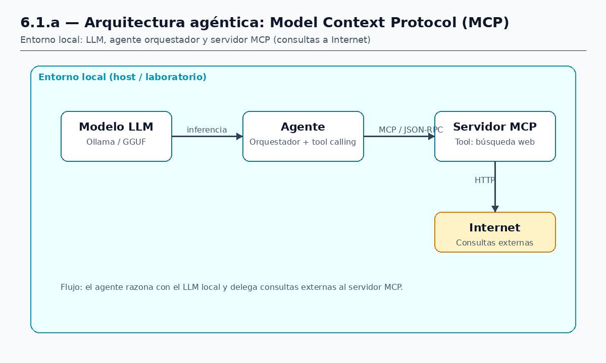
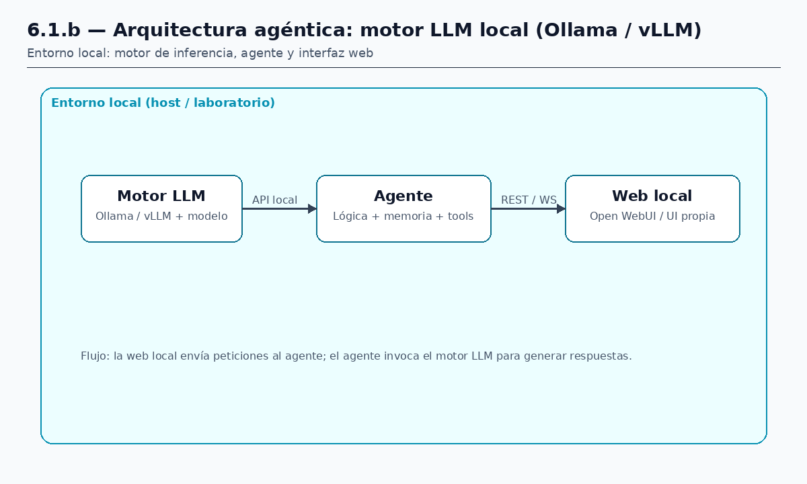
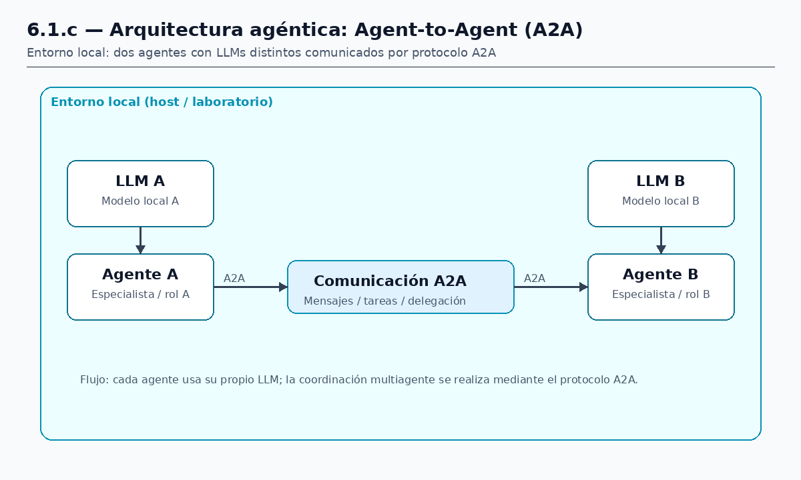

# 3.1 Caso 1 — Arquitecturas agénticas

**Estado:** En desarrollo

## Objetivo

Documentar y analizar las **arquitecturas agénticas locales** estudiadas en el TFM: protocolos de integración (MCP, A2A), motores de inferencia LLM, y el modelo operativo del agente (permisos, *skills* y *tools*). Base teórico-práctica para los casos ofensivos posteriores.

## Alcance

Todo lo relacionado con las arquitecturas locales desplegadas y evaluadas en el laboratorio (§2.1).

---

## 3.1.1 Arquitectura agéntica: MCP

**Objetivo:** Estudiar el **Model Context Protocol (MCP)** como capa de integración entre agente y herramientas; evaluar su superficie de ataque (descubrimiento de tools, *poisoning* de servidores, abuso de recursos).

**Componente:** [`tools/mcp-server/`](../tools/mcp-server/) (basado en `MCPs/linux-portable/mcp-hacking-tool`).

**Actores (entorno local):**

| Actor | Rol |
|-------|-----|
| **Modelo LLM** | Inferencia local (Ollama / GGUF) |
| **Agente** | Orquestador conectado al LLM; decide cuándo invocar tools |
| **Servidor MCP** | Expone operaciones externas (p. ej. consultas a Internet) vía JSON-RPC |

**Flujo:** el agente razona con el LLM local y delega operaciones externas al servidor MCP.

**Estado:** Pendiente

---

## 3.1.2 Arquitectura agéntica: motores LLM locales

**Objetivo:** Comparar cuatro motores de inferencia local como backend del agente. Para cada uno: **PoC de instalación y prueba** con al menos un modelo, analizando **comunicaciones**, **integración** con agente/web y **seguridad por defecto**.

**Actores (entorno local):**

| Actor | Rol |
|-------|-----|
| **Motor LLM** | Servicio de inferencia con modelo cargado; expone API local |
| **Agente** | Conectado al motor; gestiona contexto, memoria y tools |
| **Web local** | Interfaz (Open WebUI, Gradio o UI propia) conectada al agente o al motor |

**Metodología común PoC:** instalación → carga de modelo → prueba funcional → análisis de comunicaciones → integración con agente/web → auditoría de seguridad por defecto → informe.

| Motor | API / protocolo típico |
|-------|------------------------|
| **Ollama** | REST local (`/api/chat`, `/api/generate`) |
| **LocalAI** | OpenAI-compatible, gRPC, múltiples backends |
| **Text Generation WebUI** (Text-Gen) | API OpenAI-compatible, Gradio |
| **vLLM** | OpenAI-compatible, alto rendimiento GPU |

### 3.1.2.1 Ollama

**PoC:** instalación, modelo de prueba (`llama3.2:3b` o similar), CLI + API REST (`:11434`).

| Eje | Análisis |
|-----|----------|
| Comunicaciones | `/api/chat`, streaming |
| Integración | Cliente agente en `MCPs/linux-portable/agent-client` |
| Seguridad por defecto | Sin auth en localhost; riesgo si se expone a LAN |

**Estado:** Pendiente

### 3.1.2.2 LocalAI

**PoC:** despliegue LocalAI, modelo GGUF, API OpenAI-compatible.

| Eje | Análisis |
|-----|----------|
| Comunicaciones | `/v1/chat/completions` |
| Integración | Agente vía adaptador OpenAI-compatible |
| Seguridad por defecto | API keys opcionales, bind address |

**Estado:** Pendiente

### 3.1.2.3 Text Generation WebUI (Text-Gen)

**PoC:** [text-generation-webui](https://github.com/oobabooga/text-generation-webui), UI Gradio + API (`--api`).

| Eje | Análisis |
|-----|----------|
| Comunicaciones | Puerto Gradio, API OpenAI-compatible |
| Integración | Agente o cliente externo vía API |
| Seguridad por defecto | UI/API sin auth por defecto |

**Estado:** Pendiente

### 3.1.2.4 vLLM

**PoC:** servidor vLLM con modelo GPU, API OpenAI-compatible.

| Eje | Análisis |
|-----|----------|
| Comunicaciones | `:8000`, `/v1/completions` |
| Integración | Agente con `openai_api_base` local |
| Seguridad por defecto | Sin TLS/auth nativo |

**Estado:** Pendiente

---

## 3.1.3 Arquitectura agéntica: Agent-to-Agent (A2A)

**Objetivo:** Analizar el protocolo **Agent-to-Agent (A2A)** y patrones multiagente: reparto de responsabilidades, trazabilidad de mensajes y vectores de ataque en coordinación entre agentes.

**Actores (entorno local):**

| Actor | Rol |
|-------|-----|
| **Agente A + LLM A** | Primer agente con su propio modelo local |
| **Agente B + LLM B** | Segundo agente con modelo distinto |
| **Canal A2A** | Comunicación entre agentes (mensajes, tareas, delegación) |

**Estado:** Pendiente

---

## 3.1.4 Agentes locales: permisos, skills y tools

**Objetivo:** Auditar la configuración del agente local: asignación de *skills*, permisos sobre el sistema operativo, políticas de tool calling y debilidades en la interacción agente–SO.

**Enfoque:** superficie de ataque propia de la arquitectura agéntica (no solo del LLM aislado): permisos excesivos, abuso de herramientas, escalada de privilegios y RCE en entorno controlado.

**Escenario:** CTF de infraestructura agéntica en [`lab/ctf/`](../lab/ctf/) (Clase 2 del Módulo 10).

**Metodología:**

1. Reconocimiento de skills, permisos y memoria del agente.
2. Identificación de vectores: inyección en prompts de sistema, abuso de tools, path traversal.
3. Explotación hasta compromiso del host (RCE) en entorno autorizado.
4. Documentación de la cadena de ataque.

**Estado:** Pendiente

---

## Entregables

- Informes en [`informes/caso-1-arquitecturas-agenticas/`](../informes/)
- Fichas técnicas por motor LLM, diagramas MCP/A2A y write-up de permisos/skills

[← Montaje lab](./montaje-lab.md) · [Índice](./index.md) · [Caso 2 →](./caso-2-ataques-llms.md)
